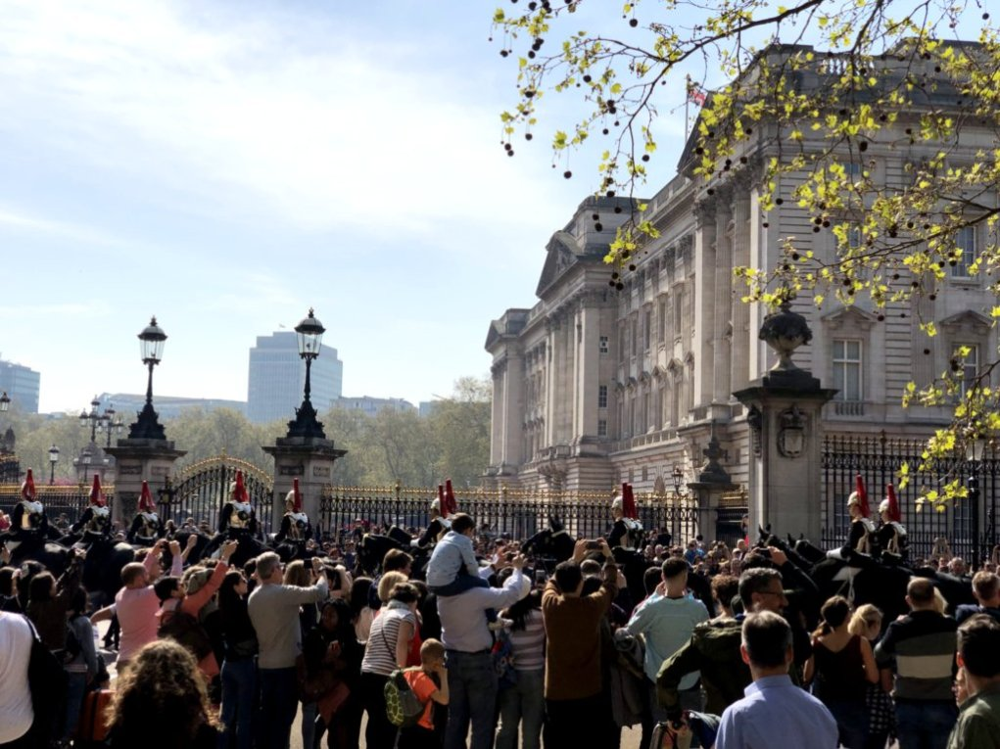
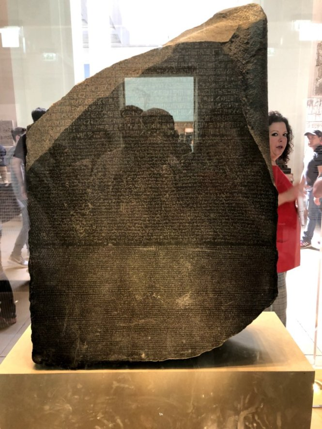

+++
title = "2019-04-19: Honeymoon Day4"
date = 2019-04-19T23:00:00
draft = false
tags = ["honeymoon", "london", "museum", "palace"]
featured_image = "images/2019-04-19-buckingham.jpeg"
description = "Toy soldiers"
+++

Today, we went to Buckingham Palace to see changing of the guard.
I've seen that before on TV. There was crowded so much. 
A lot of tourists came to see that like us.
We saw changing the guard, they were like toy soldiers.

After that, we went to British Museum to see Rosetta Stone.
I was very impressed because it was the key to
solving the mysteries of ancient Egypt.

